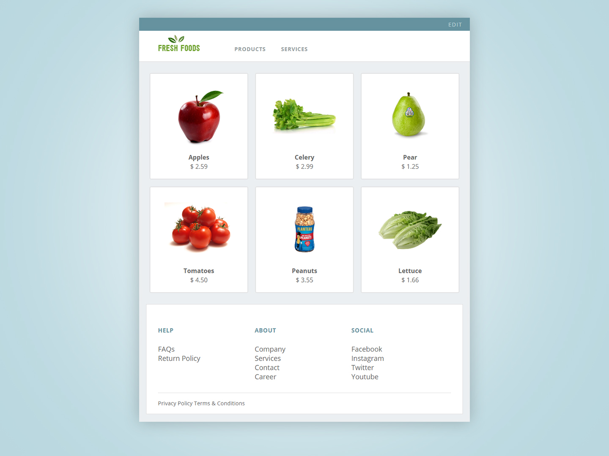
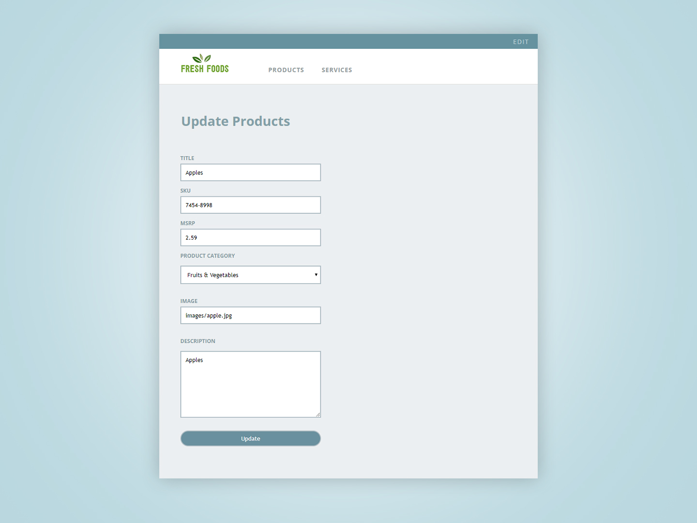
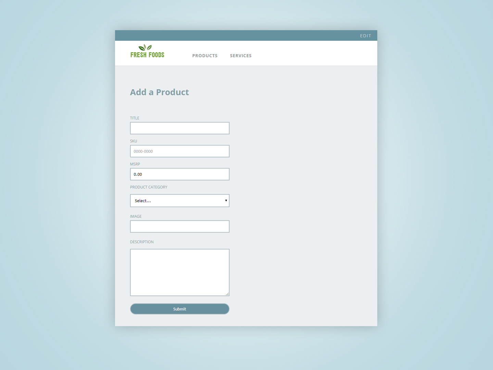
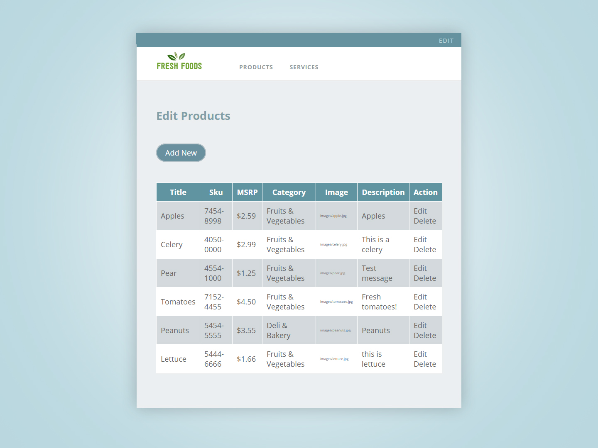

# Grocery Inventory

This application enables a user to create, edit and delete products stored in MongoDB.
It uses the Express framework and Jade template to output the products. Routers are used to display the templates.

This application utilizes Jade, Express, Node.js, and MongoDB. 

## Getting Started
* Install Node and npm (http://nodejs.org/#download). 
* Open terminal: node -v and npm -v to ensure it's installed
* Install MongoDB using: 
  * npm install mongodb
* git clone git@github.com:Kmoua/GroceryInventory.git
* cd groceryInventory
* Start application 
  * npm start and view through http://localhost:3000/

